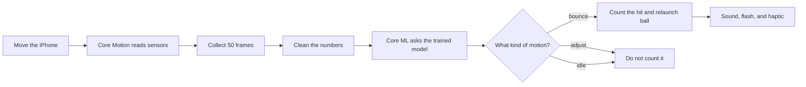
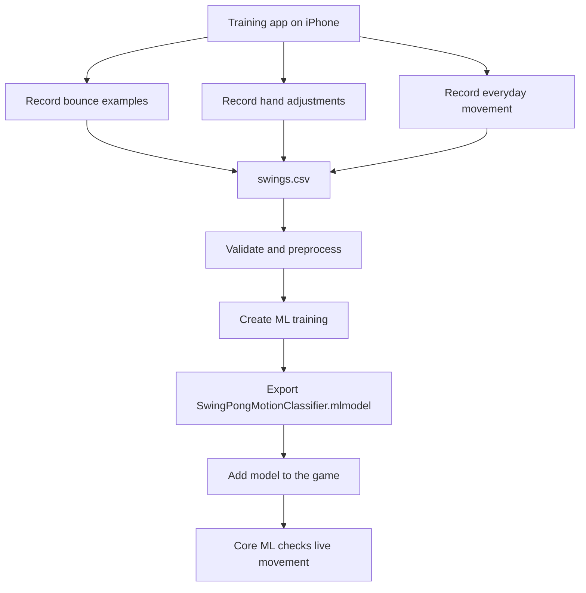
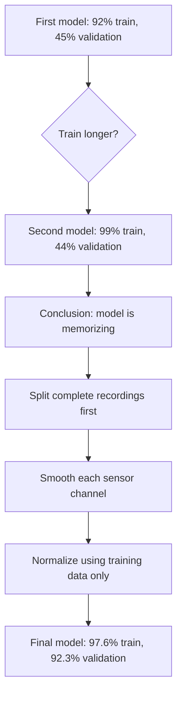

# SwingPong

SwingPong is a beginner-friendly iPhone game that turns the phone into a virtual ping-pong paddle.

The player holds the phone flat with the screen facing the ceiling. When the falling ball reaches the **HIT** zone, the player makes a small upward pop with the whole phone. A machine-learning model decides whether that movement was a real hit or only an accidental movement.

This project was built to answer one learning challenge:

> **Build a feature by training a model with Create ML, use that model with Core ML, and implement Gestalt Theory in the experience.**

This README explains what that sentence means, how the project changed while learning it, and how every part works in simple words.

---

## 1. The project in one picture



In baby words:

1. The phone feels movement.
2. The app saves a very short motion clip.
3. The trained model looks at that clip.
4. The model answers: **bounce**, **adjust**, or **idle**.
5. Only **bounce** earns a point.

---

## 2. What each technology does

Create ML and Core ML have different jobs.

| Tool | Baby explanation | What it does in SwingPong |
|---|---|---|
| **Core Motion** | The phone's movement reader | Reads acceleration, rotation, and gravity 100 times per second |
| **Create ML** | The classroom | Learns the difference between real hits and other movement from recorded examples |
| **Core ML** | The trained student inside the game | Runs the exported model on the iPhone and gives a live answer |
| **SwiftUI** | The screen builder | Draws the home screen, levels, ball, HIT prompt, settings, and feedback |
| **Gestalt Theory** | Rules for helping the brain understand visuals | Makes the ball's path and paddle easy to follow without extra instructions |

The important distinction is:

```text
Create ML = where the model learns
Core ML   = where the learned model is used
```

---

## 3. Why machine learning is actually needed

A simple acceleration threshold can notice that the phone moved strongly. It cannot reliably explain **why** it moved.

The same large movement might be:

- a real upward hit;
- changing hand grip;
- walking with the phone;
- putting the phone down;
- recovering after an earlier hit.

If the threshold is high, gentle real hits disappear. If it is low, accidental movement becomes a fake hit.

The model therefore studies the **shape of movement over time**, not only the largest number.

| Question | Simple rule | Machine-learning model |
|---|---:|---:|
| “Was the movement strong?” | Good | Can answer, but unnecessary |
| “Was this a real hit or a grip adjustment?” | Weak | This is the model's real job |
| “How high should the ball go?” | Good | Unnecessary |
| “Which way is the phone tilted?” | Good | Unnecessary |

This was an important lesson: **do not use ML for something that one easy formula already solves well.**

---

## 4. The two-app learning workflow

The project began with two separate apps so data collection would not make the game confusing.

| Project | Purpose | Used by the final player? |
|---|---|---:|
| `selfpong_model` | Guided training app that records labeled motion examples | No; it is a development tool |
| `selfpong` | The actual SwingPong game containing the Core ML model | Yes |



---

## 5. What the training app records

Each saved example is a short **0.5-second movie made of numbers**.

- The phone reads motion at **100 Hz**, meaning 100 readings each second.
- Each example contains **50 frames**, so `50 ÷ 100 = 0.5 seconds`.
- It keeps **20 frames before** the trigger and **30 frames after** it.
- A **0.35-second refractory period** prevents one movement from being saved many times.

Each frame has nine features:

| Group | CSV names | What it describes |
|---|---|---|
| User acceleration | `ua_x`, `ua_y`, `ua_z` | How the player moves the phone |
| Rotation rate | `rr_x`, `rr_y`, `rr_z` | How quickly the phone turns |
| Gravity | `g_x`, `g_y`, `g_z` | Which way the phone is facing |

The three labels are:

| Label | User-facing meaning | Should score? |
|---|---|---:|
| `bounce` | A real gentle upward pop | Yes |
| `adjust` | Grip changes or recovery movement | No |
| `idle` | Normal holding, walking, or everyday movement | No |

The received dataset contained:

| Class | Complete recordings | Frames |
|---|---:|---:|
| `bounce` | 100 | 5,000 |
| `adjust` | 100 | 5,000 |
| `idle` | 62 | 3,100 |
| **Total** | **262** | **13,100** |

Every recording was checked to contain exactly 50 ordered frames. The original `swings.csv` was kept unchanged.

---

## 6. Create ML learning iterations

The model was not good on the first try. That failure was useful because it taught the difference between **memorizing** and **learning**.

### What the two accuracy numbers mean

| Number | Baby explanation |
|---|---|
| Training accuracy | How well the model answers examples it studied |
| Validation accuracy | How well it answers different examples it did not study directly |

A model with very high training accuracy but low validation accuracy is like a student who memorized the answer sheet but cannot answer a new question. This is called **overfitting**.

### Experiment history

| Iteration | Setup | Training | Validation | What we learned |
|---|---|---:|---:|---|
| 1 | Raw data, 10 training iterations | 92% | 45% | The model was already memorizing patterns that did not transfer well |
| 2 | Raw data, increased to 50 iterations | 99% | 44% | More training made memorization stronger; it did not fix the data |
| 3 | Smoothed, standardized, explicit split; 20 iterations | 97.6% | 92.3% | Better preparation and separation solved the real problem |



### Why the final preparation worked better

The preprocessing script performs these steps:

1. **Keep recordings whole.** Frames from one recording never get scattered between training and validation.
2. **Split first.** Every fifth complete recording in each class becomes validation data.
3. **Smooth tiny sensor noise.** Each value becomes 25% previous frame + 50% current frame + 25% next frame.
4. **Calculate normal values from training only.** Validation data is not allowed to leak answers into training.
5. **Standardize all nine channels.** Large-number features can no longer shout over small-number features.

The final prepared dataset was:

| Split | Recordings | Purpose |
|---|---:|---|
| Training | 210 | Teaches the model |
| Validation | 52 | Checks whether learning transfers |

Final Create ML settings:

| Setting | Value |
|---|---:|
| Template | Activity Classification |
| Prediction window | 50 frames |
| Sample rate | 100 Hz |
| Batch size | 16 |
| Maximum iterations | 20 |
| Input features | 9 motion channels |

The final validation result reached **92.3% overall**, with **100% bounce precision and 100% bounce recall** on the explicit validation set.

- **100% bounce precision** means every validation motion predicted as a bounce really was a bounce.
- **100% bounce recall** means every validation bounce was found.

> These results describe the recorded validation set. Real-world testing on more people is still important because all 262 current recordings came from the primary participant.

---

## 7. How Core ML works inside the game

The exported model lives at:

`selfpong/SwingPongMotionClassifier.mlmodel`

The game must prepare live data exactly like the Create ML data. If training uses clean normalized data but the game sends raw data, the model sees a different language and its answers become unreliable.

```mermaid
sequenceDiagram
    participant P as Player
    participant M as Core Motion
    participant W as Window Collector
    participant C as Core ML
    participant G as Game Engine

    P->>M: Small upward phone pop
    M->>W: 9 sensor values at 100 Hz
    W->>W: Keep 20 frames before and 30 after
    W->>C: Smooth and normalize 50 x 9 values
    C-->>G: label plus confidence
    alt label is bounce and ball is in HIT zone
        G-->>P: +1, pong sound, flash, ball launches
    else adjust or idle
        G-->>P: No point; show gentle retry message
    end
```

There are two gates before a point is awarded:

```text
Gate 1: Is the ball inside the HIT zone?
Gate 2: Did Core ML predict "bounce"?

Both yes  -> count the hit
Any no    -> do not count it
```

This matters because the model is not merely stored inside the project. Its answer visibly changes the game.

---

## 8. The beginner Level 1 flow

Level 1 is intentionally forgiving. Its purpose is to teach one motion before adding harder spatial mechanics.

```mermaid
stateDiagram-v2
    [*] --> Home
    Home --> LevelMap: PLAY
    LevelMap --> Briefing: Open Level 1
    Briefing --> Ready: Start Level
    Ready --> Countdown: phone flat and START
    Countdown --> Playing: 3, 2, 1
    Playing --> Checking: upward movement in HIT zone
    Checking --> Playing: adjust or idle; retry
    Checking --> Playing: bounce; score plus 1
    Playing --> Complete: 3 accepted hits
    Complete --> LevelMap: Back to Levels
    Complete --> Briefing: Replay
```



| Stage | What the player sees | What the player does | Why |
|---|---|---|---|
| Home | One large PLAY button and Level 1 card | Press PLAY | No confusing controls at the start |
| Level map | Level 1 available; later levels locked | Open Level 1 | Shows future progress without overwhelming the player |
| Briefing | Three pictures and short instructions | Read Hold Flat, Wait for HIT, Pop Up | Teaches only one action at a time |
| Ready | Phone-flat progress ring | Hold phone like a tray | Prevents starting in the wrong position |
| Countdown | 3, 2, 1 | Keep the phone flat | Gives time to prepare |
| Playing | UP/WAIT or DOWN/GET READY cue, direction arrow, depth shadow, and HIT prompt | Wait while it rises; prepare while it falls; pop only on HIT | Makes depth and direction clear even when the ball changes size |
| Checking | “Got it — checking” | Wait briefly | Core ML needs the remaining post-trigger frames |
| Accepted | NICE, flash, sound, immediate contact haptic | Continue | Confirms the hit with sight, sound, and touch |
| Rejected | “Almost — try again” | Repeat gently | No punishment and unlimited retries |
| Complete | Three stars and 3/3 hits | Replay or return to map | Makes the learning goal obvious |

Level 1 deliberately:

- uses a target of only **three accepted hits**;
- keeps the ball centered and launches it straight up;
- does not use phone tilt;
- waits indefinitely in the hit zone;
- allows unlimited retries;
- hides the old `Behind` indicator;
- never lets a rejected motion end the rally.

The ball's size is not the only depth clue. While it rises, a mint arrow and **BALL GOING UP — WAIT** appear. While it falls, the arrow reverses and the message becomes **BALL COMING DOWN — GET READY**. A shadow grows near the paddle as the ball approaches. During the countdown the ball is hidden, so the high-contrast white-on-navy numbers cannot be confused with it.

---

## 9. Haptic, sound, and visual timing

Core ML needs 30 frames after the movement trigger, so its final answer arrives roughly 0.3 seconds later. Waiting that long before giving any touch feedback feels broken.

The app separates **contact feedback** from **classification feedback**:

| Moment | Immediate feedback | Later result |
|---|---|---|
| Ball enters HIT zone | HIT prompt and sound cue | Player knows when to move |
| Upward motion crosses the trigger inside the zone | Immediate rigid haptic and sensor click | Feels synchronized with the hand |
| Core ML accepts `bounce` | Green flash, NICE, pong sound, +1 | Confirms that the motion counted |
| Core ML returns `adjust` or `idle` | Orange retry message, no point | Explains that the motion was heard but rejected |

The strong contact haptic is not repeated after classification. This avoids the old bug where vibration arrived noticeably after the player's hand had already moved.

---

## 10. Gestalt Theory in SwingPong

Gestalt Theory describes how people naturally group visual information and complete missing shapes or paths. It is implemented as gameplay communication, not added as decoration.

### Continuity

**Idea:** the eye prefers to follow one smooth path.

**Implementation:** a quiet dashed vertical guide connects the ball's travel to the HIT zone. The ball moves along one predictable line instead of jumping between unrelated positions.

**What the player learns without reading:** “The ball is coming down to this exact place.”

### Common fate

**Idea:** things moving together are understood as one group.

**Implementation:** the orange ball, glow, and recorded trail share the same direction, timing, and color family.

**What the player learns without reading:** “The trail and glow belong to this ball and show where it is moving.”

### Closure

**Idea:** the brain completes a familiar shape even when part of it is hidden.

**Implementation:** only the top arc of the orange paddle is visible at the bottom of gameplay. The remainder is outside the screen, but the player still reads it as one complete paddle surface.

**What the player learns without reading:** “The phone is my paddle, and the ball should meet this surface.”

| Principle | Visible proof | Code location |
|---|---|---|
| Continuity | Dashed ball-to-hit-zone path | `selfpong/GameplayView.swift` |
| Common fate | Ball, glow, and trail move together | `selfpong/GameplayView.swift` |
| Closure | Partially hidden paddle still reads as a whole | `selfpong/GameplayView.swift` |

---

## 11. What I learned from this project

### About Create ML

- A large training score does not automatically mean a good model.
- Training longer cannot repair bad splitting or mismatched data.
- Entire recordings must stay together to prevent leakage.
- Validation data must remain unseen while calculating normalization values.
- Confusion-matrix details such as bounce recall matter more than one headline percentage.

### About Core ML

- Exporting an `.mlmodel` is only the halfway point.
- Live data must use the same feature order, frame count, smoothing, and normalization as training.
- A model is truly “used” only when its output changes app behavior.
- Classification has latency; feedback timing must be designed around that fact.
- Unit tests can prove that only `bounce` adds a score and preprocessing stays identical.

### About interaction design

- One instruction per screen is easier than one screen full of controls.
- A beginner level should teach success before introducing challenge.
- Sight, sound, and haptic feedback should describe the same event.
- Gestalt principles can reduce explanation by making the correct action visually obvious.

---

## 12. Project structure

```text
selfpong/
├── selfpong/
│   ├── ContentView.swift                  App flow and navigation
│   ├── HomeView.swift                     Home screen
│   ├── LevelMapView.swift                 Level journey
│   ├── LevelBriefingView.swift            Three beginner instructions
│   ├── GameplayView.swift                 Ball, HIT UI, Gestalt visuals
│   ├── LevelCompleteView.swift            3/3 success screen
│   ├── GameEngine.swift                   Rules, states, scoring, feedback
│   ├── MotionWindowCollector.swift        20-before and 30-after capture
│   ├── MotionClassifier.swift             Matching preprocessing and Core ML call
│   ├── GameSoundPlayer.swift              Low-latency game sounds
│   ├── SpatialEngine.swift                Ball projection helpers
│   └── SwingPongMotionClassifier.mlmodel  Exported trained model
├── selfpongTests/
│   └── selfpongTests.swift                Motion, preprocessing, scoring, pause tests
└── README.md                              This guide

../selfpong_model/
├── dataset/swings.csv                     Original recorded dataset
├── dataset/CreateMLNormalized50/           Prepared Create ML folders
└── tools/prepare_normalized_experiment.py Data validation and preprocessing
```

---

## 13. Build and test status

- Deployment target: **iOS 26.0 or newer**
- Orientation: **portrait iPhone**
- Simulator build: successful
- Signed physical-device build: successful
- Latest beginner build: installed on the development iPhone
- Test bundle: builds successfully
- Source branch: `main`
- Preserved first version: `v1`
- Preserved model work: `model-v1`

Core Motion does not provide real movement in the iOS Simulator. Use a physical iPhone when testing phone readiness, real hits, Core ML predictions, haptics, and motion timing.

---

## 14. Simple demonstration script

This demonstrates all three challenge requirements in about one minute.

| Time | Show | Say |
|---:|---|---|
| 0–15 sec | Create ML metrics and class results | “I trained an Activity Classification model using my recorded 50-frame motion examples.” |
| 15–35 sec | Play Level 1 and make a valid hit | “Core ML checks live phone movement. Only a predicted bounce inside the HIT zone adds a point.” |
| 35–45 sec | Make a hand adjustment that does not score | “The same motion threshold hears movement, but the model rejects movements that are not real hits.” |
| 45–60 sec | Point to guide, trail/glow, and partial paddle | “Continuity shows the path, common fate groups the moving ball effects, and closure lets us understand the partially hidden paddle.” |

---

## 15. Current limitations and honest next steps

- The validation results are strong, but the current dataset contains only the primary participant. Record a guest participant for a truly untouched person-level test.
- Level 1 intentionally removes tilt and off-screen play. Those mechanics belong in later levels after the straight-up motion feels reliable.
- The success celebration currently uses lightweight native SwiftUI animation. A licensed Lottie celebration and a custom branded Rive paddle can be added later without changing the motion-classification architecture.
- Real-device playtesting is still the final truth for haptic timing, sound feel, and gentle-hit comfort.

The main lesson is simple:

> **Create ML taught the app what a real hit looks like. Core ML lets the iPhone recognize it live. Gestalt Theory helps the player understand what to do without needing a long explanation.**
